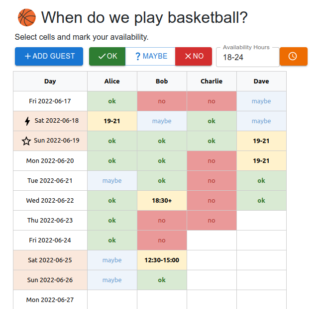
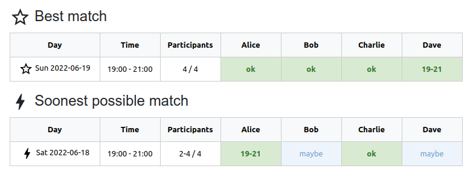
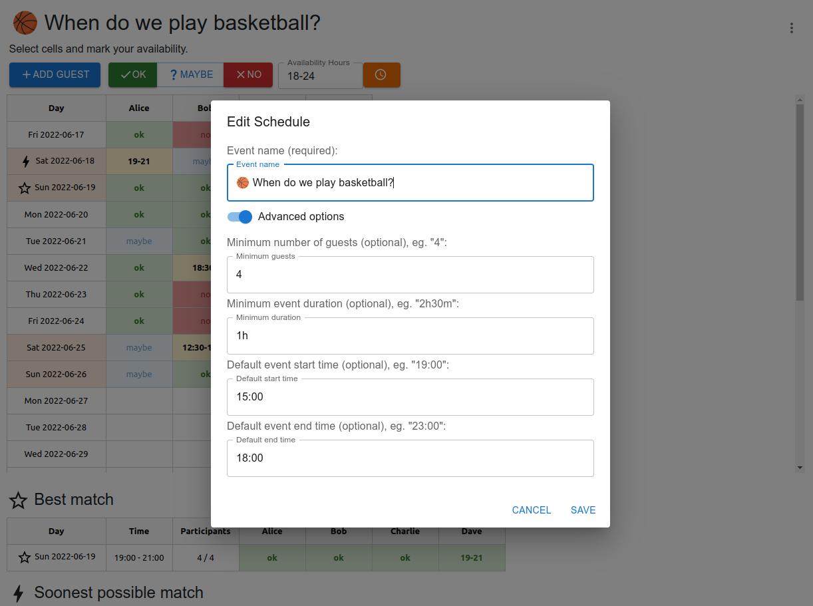

# Schedulio

[](https://github.com/igrek51/schedulio)
[](https://hub.docker.com/r/igrek52/schedulio)

Schedulio lets you plan your periodic events continuously.

1. Vote for the days with your firends.
2. Let Schedulio find the best match for you.
3. Repeat.

## Example screenshots







## Run from Docker Hub
Install [Docker](https://docs.docker.com/desktop/linux/install/#supported-platforms), run:

```bash
docker run --rm -it -p 8000:8000 -u 1000 --name schedulio igrek52/schedulio
```

and visit [http://127.0.0.1:8000](http://127.0.0.1:8000)

## Local Setup

```bash
make setup # setup virtualenv and install dependencies
. venv/bin/activate # activate virtualenv
```

### Running

Run on localhost:
```
make run
```

and visit [http://127.0.0.1:8000](http://127.0.0.1:8000).

You can also run it inside a local docker container:
```
make run-docker
```

### Database Management

Visit [http://127.0.0.1:8000/admin](http://127.0.0.1:8000/admin) endpoint to access administration panel and manage data models.
Default username & password is `admin` / `admin`.
In first place, reset the database and setup your admin account with:

```bash
make recreate-db
```

## Endpoints
- `/` - home page (frontend app)
- `/admin` - administration panel
- `/docs` - API documentation
- `/api/status` - Server status and version

## Tech stack

- **Python 3.8** - backend
- **Fastapi** & **Uvicorn** - serving API
- **Django** - managing data models
- **SQLite** - storing data
- [**nuclear**](https://github.com/igrek51/nuclear) - logging and error handling
- **Docker** - containerization
- **React** & **Typescript** - frontend app
- **Material UI** - UI component library

## Testing

Run unit tests with:

```bash
make test
```
